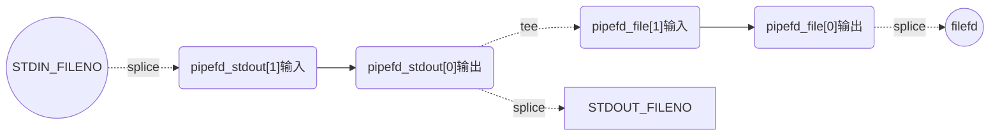

# 高级I/O函数

## dup函数和dup2函数

有时我们希望把标准输入重定向到一个文件，或者把标准输出重定向到一个网络连接（CGI）编程。可以通过`dup``dup2`实现。

```c++
#include <unistd.h>
int dup(int fd);
int dup2(int fd_one, int fd_two);
```
`dup`函数创建一个新的文件描述符，该新文件描述符和原有文件描述符fd指向相同的文件、管道或者网络连接。并且dup返回的fd总是取系统当前可用的最小整数值。

`dup2`类似，但它返回第一个不小于fd_two的整数值。

失败时返回-1并设置errno。
·
dup和dup2创建的fd不继承原文件描述符的树形。

示例server是一个简单的CGI服务器。通用网关接口（Common Gateway Interface）是一个Web服务器主机提供信息服务的标准接口。

程序先关闭标准输出文件描述符`STDOUT_FILENO`，其值为1，然后复制socket文件描述符connfd。因为dup总是返回系统中最小可用fd，所以本程序一定返回1。服务器输出到标准输出的内容就会直接发送到客户链接对应的socket上。

使用telnet连接服务器，注意输出的“connect success”直接显示在客户端。
```
Trying 127.0.0.1...
Connected to localhost.
Escape character is '^]'.
connect success
Connection closed by foreign host.
```

## readv 和 writev

readv是分散读，将数据从文件描述符读取到不连续的内存块中  
write是集中写，将数据从不同的内存块集中写到一个文件描述符中

writev使用场景：
http响应报文响应头和响应体存放在不同的位置，写出到socket不用合并在一起，使用writev，把多个不同的缓存写出到一个fd上。

```c++
#include <sys/uio.h>
ssize_t readv(int fd, const struct iovec *iov, int iovcnt);
ssize_t writev(int fd, const struct iovec *iov, int iovcnt);
```
`readv`函数从文件描述符fd读取数据到iovec结构体数组iov中，数组的大小为iovcnt。每个iovec结构体指定了一个缓冲区的起始地址和长度。

`writev`函数将iovec结构体数组iov中的数据写入到文件描述符fd中，数组的大小为iovcnt。每个iovec结构体指定了一个缓冲区的起始地址和长度。

成功时返回读取或写入的字节数，失败时返回-1并设置errno。

示例展示了HTTP如何利用writev发送文件。

如果用telnet连接服务器会显示如下消息，可以看到文件的内容被使用http报文传给客户端。
```
Trying 127.0.0.1...
Connected to localhost.
Escape character is '^]'.
HTTP/1.1 200 OK
Content-Length: 26

Hello, this is the server.Connection closed by foreign host.
```


## sendfile

sendfile 几乎是专门为在网络上传输文件而设计的。它可以在内核态直接传递数据，避免内核缓冲区和用户缓冲区的拷贝，效率很高。

```c++
#include <sys/sendfile.h>
ssize_t sendfile(int out_fd, int in_fd, off_t* offset, size_t count);
```

`in_fd`：待读出文件描述符
`out_fd`：待写入文件描述符
`offset`：指定从读入文件流的哪个位置开始读
`count`：指定在文件描述符in_fd和out_fd之间传输的字节数。

sendfile成功时返回传输的字节数，失败则返回-1并设置errno。

该函数`in_fd`必须指向真实文件，`out_fd`必须是一个socket。

注意：如果使用macos系统，sendfile在 sys/socket.h中定义，略有区别。

## mmap & munmap

用于申请一段内存空间，将这段内存作为进程间通信的共享内存，也可以将文件直接映射到其中。munmap释放这段空间。如何使用放在后面学习。


## splice 

splice函数用于在两个文件描述符之间移动数据，也是零拷贝操作。splice函数的定义如下：

```c++
#include <fcntl.h>

ssize_t splice(int fd_in, loff_t* off_in, int fd_out, loff_t off_out, size_t len, unsigned int flags);
```

限制：
fd_in,fd_out 必须有一个是管道。

splice函数成功时返回移动字节的数量，可能为0；失败返回-1并设置errno。

## tee

tee也是零拷贝函数，用于在两个**管道**之间进行复制数据。它特点是不消耗数据，音测源文件描述符上的数据仍然可以用于后续操作。

```c++
#include <fcntl.h>
ssize_t tee(int fd_in, int fd_out, size_t len, unsigned int flags);
```

[示例](./06tee/test_tee.cpp)实现了一个linux的tee命令，利用tee函数不消耗数据特性，将管道输出端连接到标准输出和文件，实现同时输出到终端和文件。

从下图可以看清管道、标准输入、文件fd之间的连接关系。



## fcntl

fcntl函数，正如其名字(file control) 描述的那样，提供了对文件描述符的各种控制操作。另外一个常见的控制文件描述符属性和行为的系统调用是ioctl，而且ioctl 比 fcntl能够执行更多的控制。但是，对于控制文件描述符常用的属性和行为，fcntl函数是由POSIX规范指定的首选方法。所以本书仅讨论fcntl雨数。fcntl函数的定义如下：

```c++
#include <fcntl.h>
int fcntl(int fd, int cmd, ...)
```

该函数可以实现的功能有:
- 复制文件描述符
- 获取和设置文件描述符的标志
- 获取和设置文件描述符的状态标志
- 管理信号
- 管理管道容量