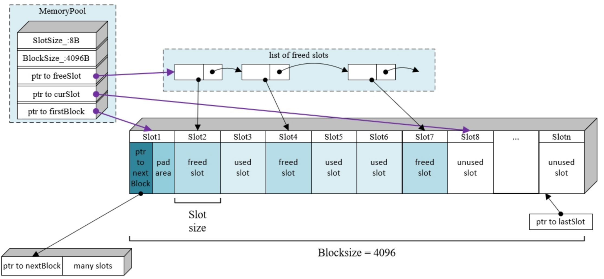
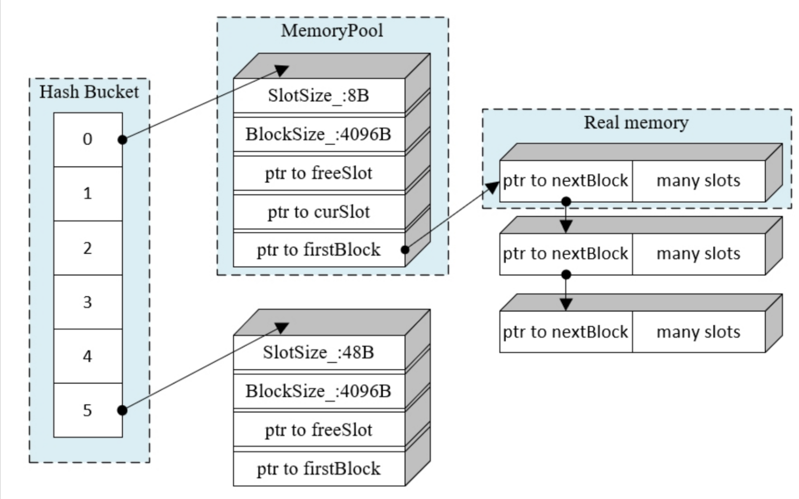

# 内存池v1

## 多种定长内存池

- 支持多种长度内存分配
- 每种使用一个定长内存池进行分配
- 线程安全（互斥锁控制）

## 数据结构

主要是两个结构
1. 每个单一内存池的实现

内存池里会有很多内存块，如果已有内存不够用了， 就申请新的内存块；这些内存块通过链表连接起来，每个块的第一个槽来统一存放下一个内存块的指针。

* `currentBlock` ： 指向第一个可用内存块

* `freeSlot` ： 内存池刚刚创建时`freeSlot`是空的，用户创建对象，将对象释放时，把内存归还给内存池，此时内存池不会将内存归还给系统，而是把指针加到`freeList`链表的前面（前插），之后每次用户申请，就先在这个链表里找

* `currentSlot` ： 指向的是一个内存块中还没有被分配过的内存槽。如果用户请求内存时`freeList`里没有，就使用`currentSlot`指向的槽，并将`currentSlot`向后移动。如果内存请求比较多，`currentSlot`应该会很快指向最后一个的后面那块。

2. 哈希桶

这里主要是使用一个哈希表的形式，把可以分配不同大小的内存槽的内存池集中在一起。请求内存时，哈希桶先计算出内存对齐好后的内存大小，然后用适合大小的内存池进行分配。

3. 两个重要接口

`T* newElement(Args&&... args);` : 用户通过`newElement<T>()`方法申请内存。
  
`void deleteElement(T* p)`: 调用`deleteElement()`函数释放内存。

## 流程

1. 用户`newElement<T>`请求内存
2. `newElement<T>` 调用`useMemeory` 计算内存对齐后合适的槽大小`size`， 调用单例模式`getMemoryPool(size).allocate()`进行内存槽分配
3. `allocate()`函数首先查找`freeList_`里是否有空闲块，如果有直接取出并返回，同时`freeList_`向后移动；如果没有，就使用`curSlot——`进行分配；如果`curSlot_`指向最后一块的位置，说明这个内存块没有空间了，需要申请新内存块，则使用`allocateNewBlock()`。

